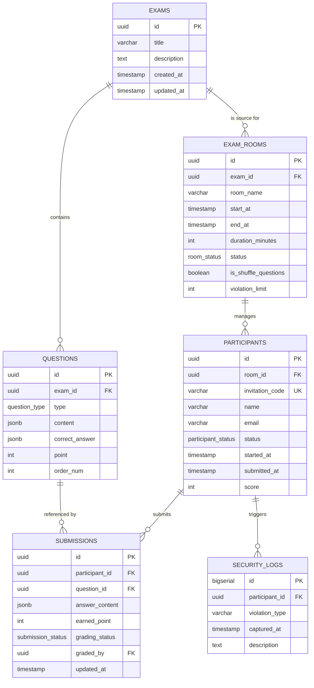

# Database

## 2. 데이터 관계 및 설계 논리

### 2.1 마스터 데이터 체계 (Exam & Question)

- **1:N 관계:** 하나의 시험(Exam)은 여러 개의 문항(Question)을 포함함.
- **유연한 구조:** `JSONB` 타입을 사용하여 객관식, 주관식 등 다양한 문항 형태를 단일 테이블에서 관리함.
- **배점 및 순서:** 각 문항은 독립적인 배점(`point`)과 정렬 순서(`order_num`)를 가짐.

### 2.2 운영 세션 체계 (Exam Room & Participant)

- **논리적 분리:** 동일한 시험(Exam)을 기반으로 하더라도 여러 시험장(Exam Room)을 개설하여 초대코드 그룹을 독립적으로 관리함.
- **초대코드 격리:** `PARTICIPANTS`는 특정 `EXAM_ROOM`에 종속되며, 유니크한 초대코드(`invitation_code`)를 통해 본인 세션에 진입함.
- **시간 제어:** 시험장 전체 일정(`start_at`, `end_at`)과 개인별 응시 시간(`duration_minutes`)을 결합하여 엄격한 타이머 로직을 수행함.

### 2.3 응시 및 보안 기록 (Submission & Security Log)

- **실시간 답안 캐싱 및 저장:** 응시자 마킹 시 트래픽 부하 경감을 위해 Redis에 임시 저장(Write-back 캐싱) 후 일정한 간격으로 `SUBMISSIONS` 테이블에 데이터가 일괄 처리(`Bulk UPSERT`)됨.
- **문항 참조 및 채점 상태:** 각 답안은 어떤 수험생이 어떤 문항에 답했는지(`participant_id`, `question_id`)를 기록하며, 주관식 수동 채점을 위해 상태 값(`grading_status` - PENDING, AUTO_GRADED, MANUAL_GRADED 등) 관리함.
- **부정행위 추적:** 시험 도중 발생하는 윈도우 이탈 등의 이벤트는 `SECURITY_LOGS`에 시계열로 저장되어 관리자 대시보드에 실시간 푸시됨.

## 3. DB 최적화 액션 아이템

- **인덱스 전략:** 초대코드 조회(`idx_invitation_code`)와 실시간 로그 추적(`idx_violation_tracker`)을 위한 복합 인덱스를 적용하여 대규모 응시 상황에서의 조회 성능을 확보함.
- **트랜잭션 관리:** 답안 제출 시 성적 업데이트와 상태 변경을 하나의 트랜잭션으로 처리하여 데이터 일관성을 유지함.
- **데이터 보존:** 시험 종료 후 통계 분석을 위해 원본 로그와 답안 데이터를 즉시 삭제하지 않고 아카이빙 전략을 수립함.