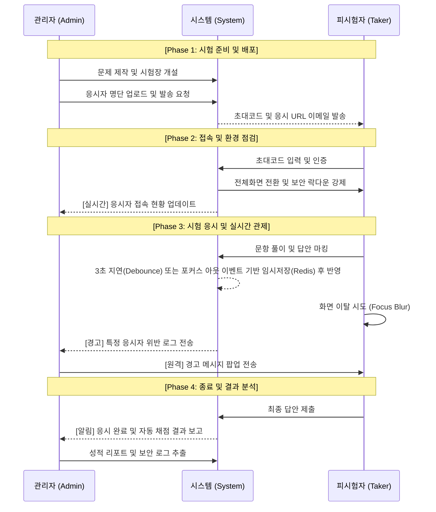

# 사용자 여정 지도

## 1. 실시간 상호작용 흐름도 (Mermaid Sequence Diagram)

## 2. 단계별 통합 여정 명세 (Integrated Journey Matrix)

| 단계 | 피시험자 행위 (Taker Actions) | 관리자 대응/관제 (Admin Actions) | 시스템 및 보안 로직 (System Logic) |
| --- | --- | --- | --- |
| **1. 배포 및 인지** | 초대 안내 메일 수신 및 응시 가이드 숙지함 | 명단 업로드 후 초대코드 발송 상태 모니터링함 | - 메일 발송 큐(Queue) 관리 및 수신 성공 여부 기록함 |
| **2. 접속 및 인증** | 초대코드 입력 후 시험 세션 진입 및 환경 점검 수행함 | 대시보드에서 실시간 접속 인원 및 미접속자 파악함 | - 코드 유효성 검증 및 중복 로그인 원천 차단함 |
| **3. 보안 활성화** | 전체 화면 전환 버튼 클릭하여 보안 샌드박스 진입함 | 환경 점검 미통과자 유무 및 기기 사양 실시간 확인함 | - Fullscreen API 강제 및 브라우저 이벤트 리스너 활성화함 |
| **4. 응시 및 관제** | 문항 풀이 진행 및 화면 집중도 유지함 | **[핵심]** 진행률 모니터링 및 보안 위반자 실시간 대응함 | - 윈도우 포커스 이탈 감지 시 즉시 위반 로그 생성 및 관리자 푸시함 |
| **5. 이상 행위 조치** | 보안 경고 수신 시 즉시 전체 화면 복귀 및 응시 재개함 | 고의적 이탈 반복 시 세션 일시 정지 또는 강제 종료함 | - 누적 위반 횟수가 한계치 초과 시 시험 자동 잠금(Lock) 처리함 |
| **6. 종료 및 분석** | 답안 최종 검토 후 제출 및 보안 모드 해제함 | 시험장 전체 종료 상태 확인 및 성적/로그 데이터 추출함 | - 제출 즉시 자동 채점 수행 및 보안 위반 타임라인 리포트 생성함 |

## 3. 상황별 핵심 액션 아이템 (Scenario-based Actions)

### [상황 A: 응시자의 고의적 화면 이탈]

- **피시험자:** 검색을 위해 창을 내리거나 다른 탭을 클릭함.
- **관리자:** 관제 화면에 '이탈 감지' 빨간색 알림 확인 후 즉시 '경고 메시지' 발송함.
- **시스템:** 해당 시점의 스크린샷 또는 위반 유형을 `security_logs` 테이블에 자동 기록함.

### [상황 B: 네트워크 단절 및 재접속]

- **피시험자:** 인터넷 불안정으로 페이지 동기화 실패 후 이탈 혹은 브라우저 재시작함 (장애 시 로컬 스토리지 보조 큐 활용).
- **시스템:** 오프라인 점유 기간 또한 타이머에 포함하여 계산함. 서버 측의 절대적인 만료 시각(`started_at + duration_minutes`)을 기준으로 잔여 시간이 남은 경우에 한해 응시를 속개시킴.
- **관리자:** '재접속 횟수'를 확인하여 기술 지원 필요 여부를 판단함.