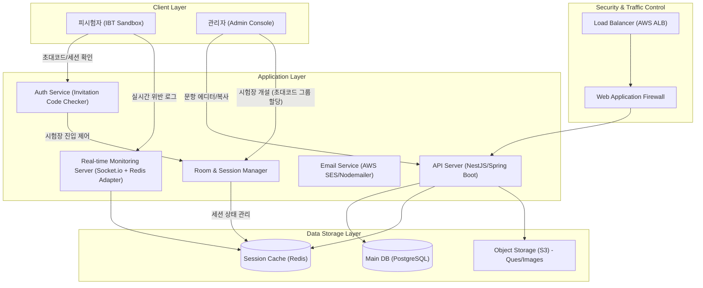

# 아키텍처

## 1. 아키텍처 개요 (Architecture Overview)

본 시스템은 대규모 동시 접속 환경에서 안정적인 시험 응시를 보장하고, 피시험자의 부정행위를 실시간으로 감지하여 관리자에게 전달하는 **'실시간 관제형 클라우드 아키텍처'**를 지향함. 또한, **풍부한 문항 에디터**와 초대코드 기반의 **시험장(Exam Room) 독립 관리 시스템**을 통해 엄격한 시험 운영 환경을 제공함.

## 2. 시스템 아키텍처 다이어그램 (Mermaid)

## 3. 시험장(Exam Room) 개념 및 구조

### 3.1 시험장 논리 모델 (Conceptual Model)

시험장은 특정 '시험지'를 '독립된 초대코드 그룹'에 할당하여 응시 권한을 격리하는 운영의 최소 단위임.

- **초대코드 독립성(Code Isolation):** 각 시험장은 고유한 초대코드 풀(Pool)을 가짐. A 시험장의 코드로 B 시험장에 접속하는 것을 원천 차단함.
- **권한 격리 운영:** 특정 그룹(초대코드 묶음)에만 유효한 시험 환경을 제공하여 운영상의 혼선을 방지하고 보안성을 강화함.

### 3.2 시험장별 핵심 제어 요소

- **접속 유효 시간(Entry Window):** 시험 시작 전후 특정 시간 동안만 입장을 허용함.
- **시험 유지 시간(Test Duration):** 입장 시점부터 개인별로 부여되는 순수 응시 시간이며, 시험장 폐쇄 시각을 초과할 수 없음.

## 4. 주요 관리 기능 상세

### 4.1 어드밴스드 문항 에디터 (Question Editor)

- **유형별 에디터:** 객관식(단일/다중 정답), 주관식(단답/서술), 빈칸 채우기 등 최적화된 입력 폼 제공함.
- **문항 복사(Clone):** 기존 등록된 문항을 기반으로 신규 문항을 즉시 생성하여 문제 은행 구축 효율을 높임.
- **리치 텍스트 지원:** 문항 내 이미지 삽입, 서식 설정(Bold, Underline 등) 지원함.

### 4.2 시험장 개설 및 운영 (Exam Room Management)

- **초대코드별 세션 분리:** 하나의 시험지를 공유하더라도 응시 대상 그룹별로 초대코드를 분리하여 독립된 시험장을 개설함.
- **스케줄링 및 타이머:** 시작/종료 일시 설정 및 서버 시간 기반 실시간 카운트다운을 통한 답안 자동 제출 처리함.

## 5. 부정행위 방지 시스템 (Anti-Cheating)

### 5.1 기술적 잠금 (Technical Lockdown)

- **브라우저 포커스 감지:** 시험 화면 이탈(Window Blur) 시 실시간 기록 및 경고(3회 위반 시 실격 처리 가능) 발부함.
- **단축키 및 우클릭 차단:** F12, Ctrl+C/V, PrintScreen 등 보안에 위협이 되는 모든 입력 차단함.
- **전체 화면 강제:** 시험 진입 시 전체 화면 모드(Fullscreen API)를 강제하며, 해제 시 즉시 암전(Black-out) 처리함.

## 6. 데이터베이스 구조 설계 (Core DB Schema)

시스템의 무결성을 위해 설계된 주요 테이블 관계 요약임.

- **Exams:** 시험 제목 및 기본 템플릿 정보 저장함.
- **Questions:** 유형(Type), 내용(JSONB), 정답 및 배점 정보 관리함.
- **Exam_Rooms:** 시험장별 스케줄, 초대코드 격리 그룹 정보 저장함.
- **Participants:** 초대코드, 개인 정보, 응시 상태(Status) 및 시작/제출 시간 기록함.
- **Security_Logs:** 위반 유형(Blur, Fullscreen Exit 등) 및 발생 시각 실시간 기록함.

## 7. 인프라 및 기술 스택 (Tech Stack)

- **Frontend:** React.js, Tailwind CSS, Zustand (상태관리), Socket.io-client.
- **Backend:** NestJS (Node.js), Prisma (ORM), Socket.io (Redis Adapter로 클러스터링).
- **Storage:** PostgreSQL (RDBMS), Redis (Pub/Sub 서버 및 Write-back 캐시), AWS S3.
- **Mail:** AWS SES / Nodemailer (초대코드 및 안내 메일 비동기 발송).

## 8. 인프라 운영 및 보안 액션 아이템

- **서버 시간 동기화:** NTP를 통한 전 서버 시간 일원화로 응시 시간 조작 차단함.
- **세션 복구 및 잔여 시간:** 네트워크 장애나 브라우저 재시작 등 오프라인 상태 점유 여부와 무관하게, 항상 DB에 기록된 `(started_at + duration_minutes)`를 개인별 절대 만료 시각으로 사용하여 공정성을 확보함.
- **메일 도메인 보안:** SPF, DKIM 설정을 통해 초대코드 메일 수신율을 확보함.